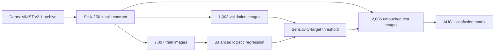

# #6 melanoma-classifier

**Measured baseline:** test AUC `0.7370`, sensitivity `0.7623`, specificity `0.5988`, and accuracy `0.6170` on `2,005` official DermaMNIST test images.

**Proves:** a leakage-aware melanoma-vs-rest evaluation pipeline trains on the official DermaMNIST training split, selects its operating threshold only on validation data, and reports untouched test performance with dataset provenance.

## Evidence

| Measure | Result |
|---|---:|
| Test ROC AUC | `0.7370` |
| Sensitivity | `0.7623` |
| Specificity | `0.5988` |
| Accuracy | `0.6170` |
| Test images | `2,005` |
| Melanoma test images | `223` |
| Confusion matrix `TN / FP / FN / TP` | `1067 / 715 / 53 / 170` |

The prior synthetic generator produced AUC `1.0` because labels directly controlled the same visual features measured by the classifier. That circular result was removed. The current number comes from real 28x28 dermatoscopic images in DermaMNIST v2.1.

## Run

```bash
docker build -t melanoma-classifier .
docker run --rm --network none melanoma-classifier
```

The image includes the verified 19.7 MB dataset archive, so the benchmark opens no network connection and needs no credential.

## Method



Images are pooled to 14x14 RGB plus channel moments. A class-balanced logistic regression provides a small, interpretable CPU baseline. The threshold maximizes validation specificity subject to sensitivity at least `0.8`; the test split is used only once for final metrics.

## Data And Safety

DermaMNIST is derived from HAM10000 and redistributed under **CC BY-NC 4.0**. The archive MD5 matches the official Zenodo record and its SHA-256 is versioned in `data/source.json`.

This reduced-resolution educational benchmark is **not intended for clinical use**. It does not establish diagnostic safety, demographic fairness, calibration, external-site generalization, or medical-device performance.

## Reproducibility

- Dataset: 7,007 train / 1,003 validation / 2,005 test images.
- Runtime: Python `3.12.13`, NumPy `2.0.2`, scikit-learn `1.7.2`.
- Raw result: `benchmarks/results/baseline.json`.
- Publication config: `benchmarks/config/dermamnist-v1.json`.
- Dataset hash: `1a309fec2e33...`.

See [REFERENCES.md](REFERENCES.md) and [data/LICENSE.md](data/LICENSE.md).
