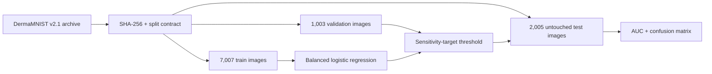

# Melanoma Detection Baseline: Leakage-Aware DermaMNIST Evaluation

**Test ROC AUC `0.7370`** with sensitivity `0.7623` on `2,005` untouched DermaMNIST test images. The threshold is chosen on validation data only, and the whole benchmark runs offline from a pinned container.

[](https://github.com/Brilhante29/melanoma-classifier/actions/workflows/validate.yml)
[](LICENSE)


> A deliberately simple, interpretable **baseline**, not a state-of-the-art claim. It fixes the evaluation protocol that stronger models (CNNs, YOLO, foundation models) should be compared against. It is **not intended for clinical use**.

## Why this exists

My published melanoma work ([HTMDS, Frontiers in Communications and Networks, 2024](https://doi.org/10.3389/frcmn.2024.1376191)) used YOLOv8 on dermoscopic images at the edge. Before any model comparison means something, the evaluation has to be trustworthy, and dermatology benchmarks often are not: thresholds get tuned on the test split, synthetic data leaks the label into the features, or accuracy is reported on a dataset where melanoma is about 11% of the images.

This repository is the reproducible floor:

- official MedMNIST v2.1 splits, with the archive verified by SHA-256 before any training;
- the operating threshold is selected on validation data to keep sensitivity at or above `0.8`, because a missed melanoma costs more than a false alarm;
- the test split is used exactly once, and the confusion matrix is published next to AUC.

An earlier synthetic generator reached AUC `1.0` because the labels controlled the same visual features the classifier measured. That circular result was removed; the number above comes from real 28x28 dermatoscopic images.

## Results

| Measure | Result |
|---|---:|
| Test ROC AUC | `0.7370` |
| Sensitivity | `0.7623` |
| Specificity | `0.5988` |
| Accuracy | `0.6170` |
| Test images | `2,005` |
| Melanoma test images | `223` |
| Confusion matrix `TN / FP / FN / TP` | `1067 / 715 / 53 / 170` |

How to read it: the model catches 170 of 223 melanomas at the cost of 715 false alarms. That is the expected trade-off for a sensitivity-first threshold on a linear model over 14x14 pooled pixels, and it is the gap a convolutional model is expected to close under the same protocol.

## Quickstart

```bash
docker build -t melanoma-classifier .
docker run --rm --network none melanoma-classifier
```

The image includes the verified 19.7 MB dataset archive, so the benchmark opens no network connection and needs no credential.

Local development:

```bash
pip install -r requirements-test.lock
pip install --no-build-isolation --no-deps -e .
pytest tests -q
```

## How it works


```mermaid
flowchart LR
  Data["DermaMNIST v2.1 archive"] --> Verify["SHA-256 + split contract"]
  Verify --> Train["7,007 train images"]
  Verify --> Validation["1,003 validation images"]
  Verify --> Test["2,005 untouched test images"]
  Train --> Model["Balanced logistic regression"]
  Validation --> Threshold["Sensitivity-target threshold"]
  Model --> Threshold
  Threshold --> Test
  Test --> Evidence["AUC + confusion matrix"]
```

Images are pooled to 14x14 RGB plus per-channel mean and standard deviation. A class-balanced logistic regression gives a small CPU baseline whose behavior is easy to inspect. The threshold maximizes validation specificity subject to sensitivity of at least `0.8`.

## Design decisions

| Decision | Why | Rejected for now |
|---|---|---|
| Linear, interpretable baseline | Establishes the floor and keeps the protocol the subject of the benchmark | Deep models before the protocol is fixed |
| Sensitivity-constrained threshold | Clinical cost is asymmetric | Accuracy-optimal threshold |
| Hash-verified archive in the image | Offline, credential-free, bit-identical reruns | Downloading at runtime |
| CLI only | Nothing here needs serving or tracking | API, database, experiment tracker, GPU |

## Limitations

- 28x28 images discard most dermoscopic detail; results do not transfer to full-resolution practice.
- No calibration, demographic fairness, or external-site evaluation.
- A single binary question (melanoma vs. rest); the six other lesion classes are pooled.

## Data and license

DermaMNIST is derived from HAM10000 and redistributed under **CC BY-NC 4.0**. The archive MD5 matches the official Zenodo record, and its SHA-256 is versioned in [`data/source.json`](data/source.json). The dataset is not covered by the code license; see [`data/LICENSE.md`](data/LICENSE.md).

## Reproducibility

- Dataset: 7,007 train / 1,003 validation / 2,005 test images; hash `1a309fec2e33...`.
- Runtime: Python `3.12.13`, NumPy `2.0.2`, scikit-learn `1.7.2`.
- Raw result: [`benchmarks/results/baseline.json`](benchmarks/results/baseline.json).
- Publication evidence and config: [`benchmarks/publication/melanoma-baseline-v2.json`](benchmarks/publication/melanoma-baseline-v2.json), [`benchmarks/config/dermamnist-v1.json`](benchmarks/config/dermamnist-v1.json).

## Project structure

```text
src/melanoma_classifier/   dataset loading, features, classifier, benchmark, CLI
tests/                     unit and contract tests on tiny arrays
data/                      hash-verified DermaMNIST archive and license
benchmarks/                config, raw results, V2 publication evidence
tools/                     benchmark and publication validators
sdd/  openspec/            specification, architecture and technical decisions
```

## How this repository is built

The project follows the spec-driven workflow of [portfolio-reuse-kit](https://github.com/Brilhante29/portfolio-reuse-kit). Requirements and decisions live in [`sdd/`](sdd) and [`openspec/`](openspec), and [`project.yaml`](project.yaml) records the architecture, stack, and rejected alternatives. Development is AI-assisted and human-governed: [`AGENTS.md`](AGENTS.md) and [`CLAUDE.md`](CLAUDE.md) hold the coding-agent instructions, while tests, validators, and CI decide what gets published.

## Related work

- [Health of Things Melanoma Detection System](https://doi.org/10.3389/frcmn.2024.1376191), Frontiers in Communications and Networks, 2024 (co-author).
- [stroke-signal-demo](https://github.com/Brilhante29/stroke-signal-demo): the same leakage-safe protocol applied to stroke CT segmentation.
- [vision-serving-fastapi](https://github.com/Brilhante29/vision-serving-fastapi): serving a trained vision model behind an instrumented API.

See [`REFERENCES.md`](REFERENCES.md) for dataset and library attribution.

## Author

**Guilherme Brilhante**, software engineer working on scalable backends and production AI.
[LinkedIn](https://www.linkedin.com/in/guilhermefreirebrilhanteseveriano/) · [GitHub](https://github.com/Brilhante29) · [Publications](https://dblp.org/pid/353/6812.html)

## License

Code: [MIT](LICENSE). Dataset: CC BY-NC 4.0, see [`data/LICENSE.md`](data/LICENSE.md).
